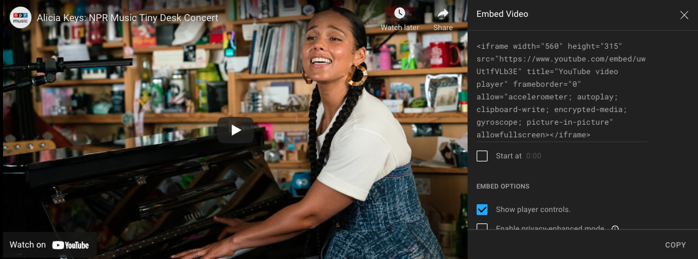

# Test2

Ok now this is test upload two.

Let’s start it with a pic

Now a link to the previous note [[Test1]]

[[Test1/First Header 2]] - this is a link to the first header in the previous note

Here is shades mp4 file downloaded from telegram

<a href='shades.mp4'>shades.mp4</a>

And a couple more from telegram 

<a href='suit.mp4'>suit.mp4</a>

<a href='gm.mp4'>gm.mp4</a>

Here’s a YouTube embed with the options in screenshot below

<iframe width="560" height="315" src="https://www.youtube.com/embed/DT5RAoXVXE4" title="YouTube video player" frameborder="0" allow="accelerometer; autoplay; clipboard-write; encrypted-media; gyroscope; picture-in-picture" allowfullscreen></iframe>

This Alicia keys one is with player controls turned off

<iframe width="560" height="315" src="https://www.youtube.com/embed/uwUt1fVLb3E?controls=0" title="YouTube video player" frameborder="0" allow="accelerometer; autoplay; clipboard-write; encrypted-media; gyroscope; picture-in-picture" allowfullscreen></iframe>

The only difference I can tell between player controls is the YouTube logo on bottom left or right…

This one starts at 46 seconds Jon batiste

<iframe width="560" height="315" src="https://www.youtube.com/embed/ze4xcmBFvaE?start=46" title="YouTube video player" frameborder="0" allow="accelerometer; autoplay; clipboard-write; encrypted-media; gyroscope; picture-in-picture" allowfullscreen></iframe>

The option for enable privacy enhancing mode is probably a good idea. It removes clutter in top right of the screen.

<iframe width="560" height="315" src="https://www.youtube-nocookie.com/embed/ze4xcmBFvaE?controls=0&amp;start=46" title="YouTube video player" frameborder="0" allow="accelerometer; autoplay; clipboard-write; encrypted-media; gyroscope; picture-in-picture" allowfullscreen></iframe>

Here is a test recording. 5 second m4a file

<a href='10-42-14.m4a'>10-42-14.m4a</a>

Here is an affinity photo file

<a href='yellow%20fractal.afphoto'>yellow fractal.afphoto</a>

Here’s a third page [[Test3]]

