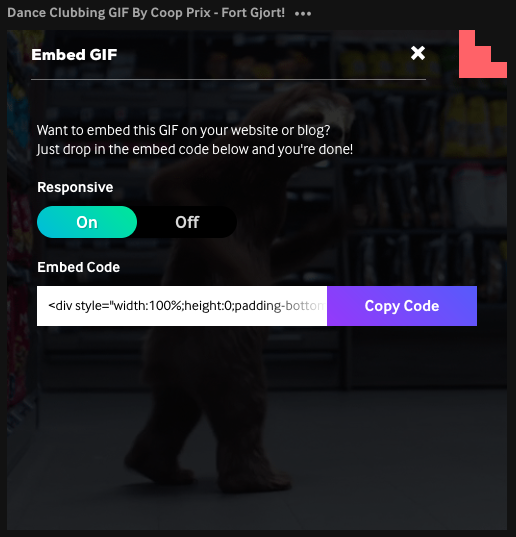
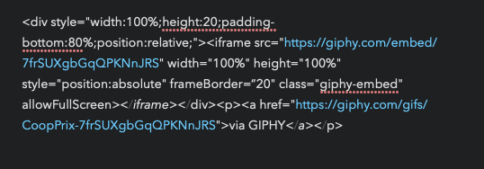

# Test3

Last note, nice!

 

 

juuu

 

dsad
 

Hey technology

<a href='10-46-23.m4a'>10-46-23.m4a</a>

This is long, not tall picture of stars

hiiii

Gif Embed from Giphy (not responsive)

  
  
  
  hellooooooo

 

  
   
  
   
  
  hiii
  
  
   
  
  
  yoooo
  
   
  
.
.

.

.

GIF embed from Giphy (responsive)

<iframe src="https://giphy.com/embed/7frSUXgbGqQPKNnJRS" width="100%" height="100%" style="position:absolute" frameBorder="0" class="giphy-embed" allowFullScreen><_iframe><_div>
<a href="https://giphy.com/gifs/CoopPrix-7frSUXgbGqQPKNnJRS">via GIPHY<_a>

NEXT - try changing the code in the giphy and YouTube embed 

50% width and height

<iframe src="https://giphy.com/embed/7frSUXgbGqQPKNnJRS" width=“50%" height=“50%" style="position:absolute" frameBorder="0" class="giphy-embed" allowFullScreen><_iframe><_div>
<a href="https://giphy.com/gifs/CoopPrix-7frSUXgbGqQPKNnJRS">via GIPHY<_a><_p>

20% width and 50% height. Just noticed there are 2 parameters for width here, this is adjusting the second one

<iframe src="https://giphy.com/embed/7frSUXgbGqQPKNnJRS" width=“20%" height=“50%" style="position:absolute" frameBorder="0" class="giphy-embed" allowFullScreen><_iframe><_div>
<a href="https://giphy.com/gifs/CoopPrix-7frSUXgbGqQPKNnJRS">via GIPHY<_a><_p>

Now adjusting the first to 60%

<iframe src="https://giphy.com/embed/7frSUXgbGqQPKNnJRS" width=“20%" height=“50%" style="position:absolute" frameBorder="0" class="giphy-embed" allowFullScreen><_iframe><_div>
<a href="https://giphy.com/gifs/CoopPrix-7frSUXgbGqQPKNnJRS">via GIPHY<_a><_p>

Now going back to 100% width and height and changing the padding

<iframe src="https://giphy.com/embed/7frSUXgbGqQPKNnJRS" width="100%" height="100%" style="position:absolute" frameBorder=“20" class="giphy-embed" allowFullScreen><_iframe><_div>
<a href="https://giphy.com/gifs/CoopPrix-7frSUXgbGqQPKNnJRS">via GIPHY<_a><_p>

Can play more with padding later, several parameters that I’m not sure about here

REMEMBER - I may need to add the <iframe> like the guy in the video for YouTube embed

ALSO - check out the hover/anchor links method if the links aren’t working right

[[Test1]]

[[Test2]] 

